# TÀI LIỆU ĐẶC TẢ KỸ THUẬT BACKEND JAVA (SPRING BOOT)
# DỰ ÁN: HỆ THỐNG QUẢN TRỊ & VẬN HÀNH ĐỘI XE ĐIỆN VINFAST (VINFAST EV PLATFORM)

> **Dành cho:** Đội ngũ Kỹ sư Backend Java (Backend Development Team)  
> **Phiên bản tài liệu:** v1.0.0  
> **Đồng bộ với Frontend:** Next.js 16 (App Router), Tailwind CSS v4, TypeScript 5  
> **Repository:** `https://github.com/KaitoDeus/VinFast-FE`  
> **Ngày phát hành:** 15/08/2026

---

## 📑 MỤC LỤC

1. [Tổng Quan Kiến Trúc & Công Nghệ Đề Xuất](#1-tổng-quan-kiến-trúc--công-nghệ-đề-xuất)
2. [Sơ Đồ Cơ Sở Dữ Liệu Quan Hệ (Database ERD)](#2-sơ-đồ-cơ-sở-dữ-liệu-quan-hệ-database-erd)
3. [Quy Chuẩn Danh Mục Enum & Data Types](#3-quy-chuẩn-danh-mục-enum--data-types)
4. [Đặc Tả Chi Tiết RESTful APIs Theo Từng Phân Hệ](#4-đặc-tả-chi-tiết-restful-apis-theo-từng-phân-hệ)
   - 4.1. Module Xác thực & Phân quyền (Authentication & RBAC)
   - 4.2. Module Quản lý Kho xe điện (Fleet & Units Management)
   - 4.3. Module Đơn đặt xe & Hợp đồng thuê (Bookings Management)
   - 4.4. Module Định vị GPS & Telemetry IoT (Vehicle Tracking & Telemetry)
   - 4.5. Module Lịch trình & Điều phối (Calendar & Scheduling)
   - 4.6. Module Quản lý Khách hàng (Clients Management)
   - 4.7. Module Quản lý Tài xế (Drivers Management)
   - 4.8. Module Tài chính, Hóa đơn & Chi phí (Financials & Invoicing)
   - 4.9. Module Trò chuyện Trực tiếp (Messages & Chat Engine)
   - 4.10. Module Đặt cọc & Khách hàng tiềm năng (B2C Pre-order & Leads)
5. [Đặc Tả Kênh WebSocket STOMP (Real-time Channels)](#5-đặc-tả-kênh-websocket-stomp-real-time-channels)
6. [Quy Chuẩn Phản Hồi API (Standard API Response Wrapper)](#6-quy-chuẩn-phản-hồi-api-standard-api-response-wrapper)
7. [Mã Nguồn Mẫu Spring Boot (Entity, DTO & Controller Sample)](#7-mã-nguồn-mẫu-spring-boot-entity-dto--controller-sample)

---

## 1. TỔNG QUAN KIẾN TRÚC & CÔNG NGHỆ ĐỀ XUẤT

Phía Frontend đã hoàn thiện 100% giao diện, tương tác và mô hình dữ liệu (TypeScript Interfaces). Phía Backend Java cần xây dựng hệ thống theo tiêu chuẩn **Clean Architecture / Hexagonal Architecture** với ngăn xếp công nghệ khuyến nghị sau:

- **Ngôn ngữ:** Java 17 hoặc Java 21 (LTS)
- **Framework cốt lõi:** Spring Boot 3.3.x (Spring Web, Spring Data JPA, Spring Security 6)
- **Cơ sở dữ liệu:** PostgreSQL 15+ (Hỗ trợ PostGIS cho tính năng bản đồ tọa độ GPS)
- **Caching & Session:** Redis (Quản lý Blacklist JWT Token, Rate-limit gửi OTP, Cache tọa độ GPS xe chạy)
- **Xác thực & Bảo mật:** JWT (JSON Web Token) với Access Token (15 phút) & Refresh Token (7 ngày), BCrypt Password Encoder
- **Giao thức Thời gian thực (Real-time):** Spring WebSocket + STOMP (hoặc MQTT Broker cho thiết bị IoT xe điện)
- **Tài liệu API:** Springdoc-OpenAPI v2 (Swagger UI 3.0)
- **Migration Cơ sở dữ liệu:** Flyway hoặc Liquibase

```
                                  KIẾN TRÚC TỔNG THỂ
  
┌─────────────────────────┐               ┌────────────────────────────────────────────────────────┐
│  Next.js 16 Frontend    │  HTTPS/REST   │               Spring Boot 3.x Backend                  │
│  (Landing / Dashboard)  │ ────────────> │  • Spring Security 6 (JWT + RBAC Filter)               │
│                         │               │  • Global Exception Handler & Response Wrapper         │
│  • React Context State  │   WebSocket   │  • Controllers (REST Endpoints)                        │
│  • Leaflet Maps & Charts│ <───────────> │  • Service Layer (Business Logic & Validation)         │
└─────────────────────────┘    (STOMP)    │  • Spring Data JPA Repositories                        │
                                          └───────────┬───────────────────────────┬────────────────┘
                                                      │                           │
                                                      ▼                           ▼
                                          ┌───────────────────────┐   ┌───────────────────────┐
                                          │ PostgreSQL 15+ PostGIS│   │  Redis Distributed    │
                                          │ (Dữ liệu quan hệ)     │   │  (OTP / Token / Cache)│
                                          └───────────────────────┘   └───────────────────────┘
```

---

## 2. SƠ ĐỒ CƠ SỞ DỮ LIỆU QUAN HỆ (DATABASE ERD)

```mermaid
erDiagram
    USERS ||--o{ BOOKINGS : places
    USERS ||--o{ REFRESH_TOKENS : has
    USERS ||--o| DRIVER_PROFILES : has
    USERS ||--o| CLIENT_PROFILES : has
    
    VEHICLES ||--o{ BOOKINGS : reserved_in
    VEHICLES ||--o{ TELEMETRY_LOGS : generates
    VEHICLES ||--o| DRIVER_PROFILES : assigned_to
    
    BOOKINGS ||--o{ INVOICES : bills
    BOOKINGS ||--o{ CALENDAR_EVENTS : schedules
    
    USERS ||--o{ CHAT_MESSAGES : sends
    USERS ||--o{ CHAT_MESSAGES : receives
    CONVERSATIONS ||--o{ CHAT_MESSAGES : contains
    
    USERS {
        uuid id PK
        string email UK
        string password_hash
        string full_name
        string phone
        string avatar_url
        string role "SUPER_ADMIN | FLEET_MANAGER | DISPATCHER | DRIVER | CLIENT"
        string status "ACTIVE | INACTIVE | BLOCKED"
        timestamp created_at
        timestamp updated_at
    }

    CLIENT_PROFILES {
        uuid id PK
        uuid user_id FK
        string residence_card_number
        string driver_license_number
        string address
        int points
        decimal total_spent
        int total_bookings
    }

    DRIVER_PROFILES {
        uuid id PK
        uuid user_id FK
        uuid assigned_vehicle_id FK
        string status "ON_DUTY | SICK_LEAVE | HALF_DAY_LEAVE"
        int experience_years
        decimal rating
        string performance_badge
        string license_number
        int monthly_work_hours
    }

    VEHICLES {
        uuid id PK
        string brand "VinFast"
        string model_name "VF 3 | VF 5 | VF 6 | VF 7 | VF 8 | VF 9 | Klara S"
        string car_type "SUV | Crossover | Compact | E_Scooter"
        string license_plate UK
        decimal daily_price
        string status "AVAILABLE | MAINTENANCE | UNAVAILABLE | RENTED"
        string transmission "AUTOMATIC | MANUAL"
        string capacity "2 seats | 5 seats | 7 seats"
        int range_km
        string battery_type "CATL | LFP"
        decimal battery_capacity_kwh
        int current_battery_percent
        int top_speed_kmh
        string acceleration_spec
        string hero_image_url
        text description
        jsonb features
        jsonb gallery_images
        int units_count
        timestamp created_at
    }

    BOOKINGS {
        uuid id PK
        string booking_code UK "BK-2028-XXXX"
        uuid client_id FK
        uuid vehicle_id FK
        uuid driver_id FK
        string rental_plan "HOURLY | DAILY | WEEKLY | MONTHLY"
        date start_date
        date end_date
        decimal total_amount
        string payment_status "PAID | UNPAID | PARTIALLY_PAID"
        string status "PENDING | APPROVED | HIRED | DONE | CANCELED"
        text notes
        timestamp created_at
    }

    TELEMETRY_LOGS {
        uuid id PK
        uuid vehicle_id FK
        double latitude
        double longitude
        double speed_kmh
        double heading
        int battery_percent
        double motor_temperature
        string engine_status "ON | OFF | IDLE"
        timestamp recorded_at
    }

    INVOICES {
        uuid id PK
        string invoice_number UK "INV-2028-XXXX"
        uuid booking_id FK
        uuid client_id FK
        decimal amount
        date due_date
        date paid_date
        string status "COMPLETED | AWAITING | OVERDUE"
        string payment_method "VNPAY | MOMO | BANK_TRANSFER | CASH | STRIPE"
        timestamp created_at
    }

    EXPENSES {
        uuid id PK
        string title
        string category "VEHICLE_MAINTENANCE | STAFF_SALARIES | FUEL_POWER | INSURANCE | OFFICE_SUPPLIES | MARKETING"
        decimal amount
        date expense_date
        string recipient_name
        string payment_method
        text description
        timestamp created_at
    }

    CONVERSATIONS {
        uuid id PK
        uuid participant_one_id FK
        uuid participant_two_id FK
        text last_message
        timestamp last_message_time
        timestamp created_at
    }

    CHAT_MESSAGES {
        uuid id PK
        uuid conversation_id FK
        uuid sender_id FK
        uuid recipient_id FK
        text content
        jsonb attachment_urls
        boolean is_read
        timestamp sent_at
    }

    OTP_VERIFICATIONS {
        uuid id PK
        string email
        string otp_code
        string purpose "RESET_PASSWORD | REGISTER_VERIFY"
        timestamp expires_at
        boolean is_used
        int attempts_count
        timestamp created_at
    }
```



---

## 3. QUY CHUẨN DANH MỤC ENUM & DATA TYPES

Các Enum trong Java bắt buộc phải ánh xạ khớp 100% với Frontend TypeScript:

```java
// 1. Phân quyền người dùng
public enum UserRole {
    SUPER_ADMIN, FLEET_MANAGER, DISPATCHER, DRIVER, CLIENT
}

// 2. Trạng thái xe điện
public enum VehicleStatus {
    AVAILABLE, MAINTENANCE, UNAVAILABLE, RENTED
}

// 3. Phân loại xe điện
public enum CarType {
    SUV, CROSSOVER, COMPACT, E_SCOOTER
}

// 4. Trạng thái đơn đặt xe
public enum BookingStatus {
    PENDING, APPROVED, HIRED, DONE, CANCELED
}

// 5. Trạng thái tài xế
public enum DriverDutyStatus {
    ON_DUTY, SICK_LEAVE, HALF_DAY_LEAVE
}

// 6. Trạng thái hóa đơn
public enum InvoiceStatus {
    COMPLETED, AWAITING, OVERDUE
}

// 7. Danh mục chi phí vận hành
public enum ExpenseCategory {
    VEHICLE_MAINTENANCE, STAFF_SALARIES, FUEL_POWER, INSURANCE, OFFICE_SUPPLIES, MARKETING
}
```

---

## 4. ĐẶC TẢ CHI TIẾT RESTFUL APIS THEO TỪNG PHÂN HỆ

Tất cả các API được bảo mật yêu cầu Header: `Authorization: Bearer <JWT_ACCESS_TOKEN>` (ngoại trừ Auth và Landing Pre-order).

### 4.1. Module Xác thực & Phân quyền (Authentication & RBAC)

#### `POST /api/v1/auth/register` - Đăng ký tài khoản
- **Request Body (JSON):**
  ```json
  {
    "fullName": "Nguyễn Văn A",
    "email": "elementary221b@gmail.com",
    "password": "Password@123"
  }
  ```
- **Response 201 Created:**
  ```json
  {
    "success": true,
    "message": "Đăng ký tài khoản thành công",
    "data": {
      "userId": "3fa85f64-5717-4562-b3fc-2c963f66afa6",
      "email": "elementary221b@gmail.com",
      "fullName": "Nguyễn Văn A",
      "role": "CLIENT"
    }
  }
  ```

#### `POST /api/v1/auth/login` - Đăng nhập
- **Request Body:**
  ```json
  {
    "email": "elementary221b@gmail.com",
    "password": "Password@123",
    "rememberMe": true
  }
  ```
- **Response 200 OK:**
  ```json
  {
    "success": true,
    "data": {
      "accessToken": "eyJhbGciOiJIUzI1NiIsInR5cCI6IkpXVCJ9...",
      "refreshToken": "d8e8fca2-dc34-4bc9-8e65-749e782918bb",
      "tokenType": "Bearer",
      "expiresIn": 900,
      "user": {
        "id": "3fa85f64-5717-4562-b3fc-2c963f66afa6",
        "email": "elementary221b@gmail.com",
        "fullName": "Nguyễn Văn A",
        "role": "SUPER_ADMIN",
        "avatar": "/team/avatar-1.png"
      }
    }
  }
  ```

#### `POST /api/v1/auth/forgot-password` - Yêu cầu mã OTP đặt lại mật khẩu
- **Request Body:**
  ```json
  {
    "email": "elementary221b@gmail.com"
  }
  ```
- **Nghiệp vụ Backend:**
  - Tạo mã OTP ngẫu nhiên 6 chữ số (ví dụ: `849201`).
  - Lưu vào bảng `OTP_VERIFICATIONS` hoặc Redis với `TTL = 300 giây (5 phút)`.
  - Rate limit: Mỗi email chỉ được bấm gửi lại sau tối thiểu **30 giây**.
  - Bắn email thông qua Spring Boot Starter Mail với mẫu template VinFast HTML.
- **Response 200 OK:**
  ```json
  {
    "success": true,
    "message": "Mã xác thực OTP đã được gửi đến email của bạn",
    "data": {
      "email": "elementary221b@gmail.com",
      "resendAvailableInSeconds": 30,
      "expiresInSeconds": 300
    }
  }
  ```

#### `POST /api/v1/auth/reset-password` - Xác thực OTP & Đổi mật khẩu mới
- **Request Body:**
  ```json
  {
    "email": "elementary221b@gmail.com",
    "otpCode": "849201",
    "newPassword": "NewSecurePassword@2028"
  }
  ```
- **Nghiệp vụ Backend:**
  - Kiểm tra tính hợp lệ của OTP (chưa hết hạn, chưa bị sử dụng, sai không quá 5 lần).
  - Hash mật khẩu mới bằng `BCryptPasswordEncoder` và cập nhật vào bảng `USERS`.
  - Đánh dấu OTP là `is_used = true`.
- **Response 200 OK:**
  ```json
  {
    "success": true,
    "message": "Mật khẩu của bạn đã được cập nhật thành công"
  }
  ```

---

### 4.2. Module Quản lý Kho xe điện (Fleet & Units Management)

#### `GET /api/v1/vehicles` - Danh sách xe phân trang & bộ lọc
- **Query Params:**
  - `page` (int, default: 1)
  - `limit` (int, default: 8)
  - `query` (string, tìm theo tên xe, biển số)
  - `carType` (enum: `SUV`, `CROSSOVER`, `COMPACT`, `E_SCOOTER`, default: `ALL`)
  - `status` (enum: `AVAILABLE`, `MAINTENANCE`, `UNAVAILABLE`, default: `ALL`)
- **Response 200 OK:**
  ```json
  {
    "success": true,
    "data": {
      "items": [
        {
          "id": "VF-001",
          "brand": "VinFast",
          "modelName": "VF 8 Plus",
          "carType": "SUV",
          "licensePlate": "30A-888.88",
          "dailyPrice": "$120",
          "status": "Available",
          "transmission": "Automatic",
          "capacity": "5 seats",
          "range": "471 km",
          "batteryFuel": "87.7 kWh (92%)",
          "topSpeed": "200 km/h",
          "acceleration": "5.5s (0-100km/h)",
          "image": "/cars/vf8.png",
          "unitsCount": 12
        }
      ],
      "pagination": {
        "currentPage": 1,
        "totalPages": 4,
        "totalItems": 32,
        "pageSize": 8
      }
    }
  }
  ```

#### `POST /api/v1/vehicles` - Thêm xe mới vào kho
- **Request Body (JSON):**
  ```json
  {
    "brand": "VinFast",
    "modelName": "VF 7",
    "carType": "Crossover",
    "licensePlate": "29B-999.99",
    "dailyPrice": 95.0,
    "transmission": "AUTOMATIC",
    "capacity": "5 seats",
    "rangeKm": 450,
    "batteryCapacityKwh": 75.3,
    "topSpeedKmh": 175,
    "accelerationSpec": "5.8s",
    "heroImageUrl": "https://vinfast-ev.vn/images/vf7.png",
    "description": "Mẫu Crossover thuần điện thể thao đột phá của VinFast."
  }
  ```

#### `GET /api/v1/vehicles/{id}` - Chi tiết xe theo ID
- **Response 200 OK:** Đầy đủ thông số kỹ thuật (Specs), Gallery ảnh, lịch sử bảo dưỡng và nhắc nhở.

---

### 4.3. Module Đơn đặt xe (Bookings Management)

#### `GET /api/v1/bookings` - Danh sách đơn đặt xe & KPIs
- **Response 200 OK:**
  ```json
  {
    "success": true,
    "data": {
      "kpis": {
        "upcomingBookings": 128,
        "pendingBookings": 45,
        "canceledBookings": 12,
        "completedBookings": 380,
        "weeklyGrowthPercentage": 2.77
      },
      "items": [
        {
          "id": "BK-2028-001",
          "bookingDate": "2028-08-01",
          "clientName": "Alice Johnson",
          "clientAvatar": "/team/avatar-1.png",
          "carModel": "VinFast VF 8",
          "rentalPlan": "Daily",
          "rentalPeriod": "01 Aug - 05 Aug 2028",
          "driverName": "Nguyễn Văn Tài",
          "paymentStatus": "Paid",
          "status": "Approved",
          "totalAmount": 480.0
        }
      ]
    }
  }
  ```

#### `POST /api/v1/bookings` - Tạo đơn đặt xe mới
- **Request Body:**
  ```json
  {
    "clientId": "3fa85f64-5717-4562-b3fc-2c963f66afa6",
    "vehicleId": "8ba12f64-5717-4562-b3fc-2c963f66afa7",
    "driverId": "1ca34f64-5717-4562-b3fc-2c963f66afa8",
    "rentalPlan": "DAILY",
    "startDate": "2028-08-20",
    "endDate": "2028-08-25",
    "notes": "Giao xe tại sân bay Nội Bài"
  }
  ```

---

### 4.4. Module Định vị GPS & Telemetry IoT (Vehicle Tracking)

#### `GET /api/v1/tracking/vehicles` - Danh sách xe đang bật định vị
- **Response 200 OK:**
  ```json
  {
    "success": true,
    "data": [
      {
        "vehicleId": "VF-001",
        "carModel": "VinFast VF 8",
        "carNumber": "30A-888.88",
        "clientName": "Alice Johnson",
        "latitude": 21.028511,
        "longitude": 105.804817,
        "speed": "48 km/h",
        "battery": "85%",
        "remainingRange": "380 km",
        "motorTemp": "38°C",
        "status": "In Transit"
      }
    ]
  }
  ```

#### `GET /api/v1/tracking/charging-stations` - Trạm sạc pin V-GREEN lân cận
- **Query Params:** `lat`, `lng`, `radiusKm` (default: 10)
- **Response 200 OK:** Danh sách các trạm sạc V-GREEN, số cổng sạc còn trống và khoảng cách.

---

### 4.5. Module Lịch trình & Điều phối (Calendar & Scheduling)

#### `GET /api/v1/calendar/events` - Sự kiện nhận/trả xe theo tuần
- **Query Params:** `weekStartDate` (e.g. `2028-08-01`), `filter` (`ALL`, `PICKUP`, `RETURN`)
- **Response 200 OK:** Danh sách các ca giao xe (Pickup) và thu hồi xe (Return) khớp với bảng lịch trình Dashboard.

---

### 4.6. Module Quản lý Khách hàng (Clients Management)

#### `GET /api/v1/clients` - Danh sách khách hàng
- **Response 200 OK:**
  ```json
  {
    "success": true,
    "data": [
      {
        "id": "CLT-001",
        "name": "Alice Johnson",
        "email": "alice@gmail.com",
        "phone": "+84 912 345 678",
        "residenceCard": "Alice's Residence Card.pdf",
        "driverLicense": "Alice's Driver License.pdf",
        "points": 1450,
        "status": "Active"
      }
    ]
  }
  ```

---

### 4.7. Module Quản lý Tài xế (Drivers Management)

#### `GET /api/v1/drivers` - Danh sách tài xế & ca làm việc
- **Response 200 OK:** Trả về họ tên, avatar, số giờ làm việc trong tháng (`workHours`), đánh giá sao (`rating: 4.8`), huy hiệu (`performanceBadge: "Excellent"`), trạng thái (`On Duty`, `Sick Leave`, `Half-Day Leave`).

---

### 4.8. Module Tài chính & Hóa đơn (Financials)

#### `GET /api/v1/financials/overview` - Tổng quan tài chính & Cashflow
- **Response 200 OK:**
  ```json
  {
    "success": true,
    "data": {
      "kpis": {
        "balance": 155820.0,
        "income": 25700.0,
        "expenses": 14575.0,
        "incomeGrowth": 2.73,
        "expenseGrowth": -5.70
      },
      "cashflowMonthly": [
        { "month": "Jan", "income": 12000, "expense": 9000 },
        { "month": "Feb", "income": 14000, "expense": 11000 },
        { "month": "May", "income": 16000, "expense": 13000 }
      ],
      "expenseBreakdown": [
        { "category": "Vehicle Maintenance", "percentage": 30, "amount": 3000.0 },
        { "category": "Staff Salaries", "percentage": 25, "amount": 2500.0 },
        { "category": "Fuel & Power", "percentage": 20, "amount": 2000.0 },
        { "category": "Insurance", "percentage": 15, "amount": 1500.0 }
      ]
    }
  }
  ```

---

### 4.9. Module Trò chuyện Trực tiếp (Messages & Chat Engine)

#### `GET /api/v1/messages/threads` - Danh sách các cuộc trò chuyện
- **Response 200 OK:** Trả về danh sách threads nhóm theo `Today` và `Yesterday`, avatar đối phương, tin nhắn cuối cùng, số tin chưa đọc (`unreadCount`).

#### `GET /api/v1/messages/threads/{threadId}/history` - Lịch sử tin nhắn
- **Query Params:** `page`, `limit` (default: 50).

---

### 4.10. Module Đặt cọc & Khách hàng tiềm năng (B2C Landing Pre-orders)

#### `POST /api/v1/preorders` - Khách đặt cọc xe máy điện từ Landing page
- **Public API (Không cần Auth Token)**
- **Request Body:**
  ```json
  {
    "fullName": "Trần Văn Bình",
    "phone": "0988776655",
    "email": "binh.tv@gmail.com",
    "color": "Red",
    "scooterModel": "Klara S",
    "content": "Tôi muốn nhận xe tại showroom VinFast Royal City"
  }
  ```

---

## 5. ĐẶC TẢ KÊNH WEBSOCKET STOMP (REAL-TIME CHANNELS)

Hỗ trợ luồng dữ liệu tức thì cho GPS và Live Chat qua giao thức WebSocket STOMP (`/ws`):

### 5.1. Kênh Định Vị Tọa Độ GPS Xe Điện
- **Subscribe URL:** `/topic/telemetry/{vehicleId}` hoặc `/topic/telemetry/fleet`
- **Payload Broadcast từ Backend xuống Frontend:**
  ```json
  {
    "vehicleId": "VF-001",
    "lat": 21.028511,
    "lng": 105.804817,
    "speed": 52,
    "batteryPercent": 84,
    "motorTemp": 39.2,
    "timestamp": "2028-08-15T14:30:00Z"
  }
  ```

### 5.2. Kênh Trò Chuyện Trực Tiếp (Chat Engine)
- **Send Endpoint (Client -> Server):** `/app/chat.sendMessage`
- **User Specific Queue (Server -> Client):** `/user/queue/messages`

---

## 6. QUY CHUẨN PHẢN HỒI API (STANDARD API RESPONSE WRAPPER)

Tất cả các endpoint của Spring Boot bắt buộc trả về theo định dạng chuẩn:

```json
// Phản hồi thành công
{
  "success": true,
  "message": "Thao tác thành công",
  "data": { ... },
  "timestamp": "2028-08-15T14:30:00.123Z"
}

// Phản hồi lỗi
{
  "success": false,
  "message": "Mã xác thực OTP không chính xác hoặc đã hết hạn",
  "errorCode": "AUTH_OTP_INVALID",
  "errors": [
    { "field": "otpCode", "reason": "Phải có đúng 6 chữ số" }
  ],
  "timestamp": "2028-08-15T14:30:00.123Z"
}
```

---

## 7. MÃ NGUỒN MẪU SPRING BOOT (SAMPLE CODE)

### 7.1. Entity Mẫu: `VehicleEntity.java`
```java
package com.vinfast.platform.domain.entity;

import com.vinfast.platform.domain.enums.CarType;
import com.vinfast.platform.domain.enums.VehicleStatus;
import jakarta.persistence.*;
import lombok.*;
import org.hibernate.annotations.CreationTimestamp;
import java.math.BigDecimal;
import java.time.LocalDateTime;
import java.util.UUID;

@Entity
@Table(name = "vehicles")
@Getter
@Setter
@NoArgsConstructor
@AllArgsConstructor
@Builder
public class VehicleEntity {

    @Id
    @GeneratedValue(strategy = GenerationType.UUID)
    private UUID id;

    @Column(nullable = false)
    private String brand = "VinFast";

    @Column(name = "model_name", nullable = false)
    private String modelName;

    @Enumerated(EnumType.STRING)
    @Column(name = "car_type", nullable = false)
    private CarType carType;

    @Column(name = "license_plate", unique = true, nullable = false)
    private String licensePlate;

    @Column(name = "daily_price", nullable = false)
    private BigDecimal dailyPrice;

    @Enumerated(EnumType.STRING)
    @Column(nullable = false)
    private VehicleStatus status = VehicleStatus.AVAILABLE;

    private String transmission = "Automatic";
    private String capacity = "5 seats";

    @Column(name = "range_km")
    private Integer rangeKm;

    @Column(name = "battery_fuel_percent")
    private Integer batteryFuelPercent;

    @Column(name = "hero_image_url")
    private String heroImageUrl;

    @Column(columnDefinition = "TEXT")
    private String description;

    @CreationTimestamp
    @Column(name = "created_at", updatable = false)
    private LocalDateTime createdAt;
}
```

### 7.2. Controller Mẫu: `AuthController.java`
```java
package com.vinfast.platform.interfaces.rest;

import com.vinfast.platform.application.dto.request.*;
import com.vinfast.platform.application.dto.response.*;
import com.vinfast.platform.application.service.AuthService;
import io.swagger.v3.oas.annotations.Operation;
import io.swagger.v3.oas.annotations.tags.Tag;
import jakarta.validation.Valid;
import lombok.RequiredArgsConstructor;
import org.springframework.http.HttpStatus;
import org.springframework.http.ResponseEntity;
import org.springframework.web.bind.annotation.*;

@RestController
@RequestMapping("/api/v1/auth")
@RequiredArgsConstructor
@Tag(name = "Authentication", description = "Các API đăng nhập, đăng ký và đặt lại mật khẩu OTP")
public class AuthController {

    private final AuthService authService;

    @PostMapping("/login")
    @Operation(summary = "Đăng nhập hệ thống")
    public ResponseEntity<ApiResponse<LoginResponse>> login(@Valid @RequestBody LoginRequest request) {
        LoginResponse response = authService.authenticate(request);
        return ResponseEntity.ok(ApiResponse.success(response));
    }

    @PostMapping("/register")
    @ResponseStatus(HttpStatus.CREATED)
    @Operation(summary = "Đăng ký tài khoản người dùng mới")
    public ResponseEntity<ApiResponse<UserDto>> register(@Valid @RequestBody RegisterRequest request) {
        UserDto user = authService.registerUser(request);
        return ResponseEntity.status(HttpStatus.CREATED).body(ApiResponse.success(user));
    }

    @PostMapping("/forgot-password")
    @Operation(summary = "Yêu cầu mã OTP 6 số để đặt lại mật khẩu qua email")
    public ResponseEntity<ApiResponse<OtpResponse>> forgotPassword(@Valid @RequestBody ForgotPasswordRequest request) {
        OtpResponse response = authService.sendPasswordResetOtp(request.getEmail());
        return ResponseEntity.ok(ApiResponse.success(response));
    }

    @PostMapping("/reset-password")
    @Operation(summary = "Xác thực mã OTP và thiết lập mật khẩu mới")
    public ResponseEntity<ApiResponse<Void>> resetPassword(@Valid @RequestBody ResetPasswordRequest request) {
        authService.resetPasswordWithOtp(request);
        return ResponseEntity.ok(ApiResponse.success("Mật khẩu đã được đặt lại thành công", null));
    }
}
```

---

> [!TIP]
> **Khuyến nghị kết nối:** Đội ngũ Backend Java có thể cấu hình CORS (`allowedOrigins = "http://localhost:3000", "https://vinfast-ev.vn"`) để Frontend Next.js kết nối trực tiếp hoặc thông qua API Proxy Rewrite trong file `next.config.ts`.
