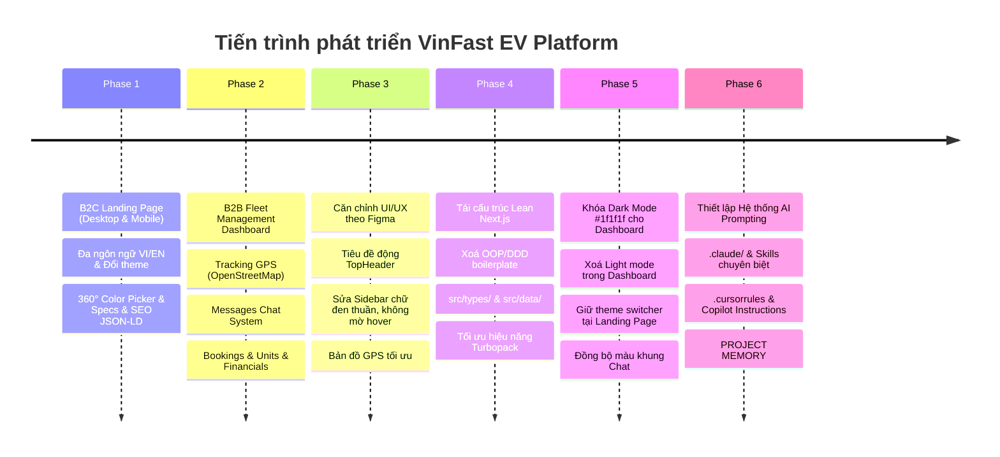

# VinFast EV Platform - Project Memory, Architecture & Future Roadmap

Tài liệu này ghi lại toàn bộ **lịch sử tiến trình phát triển**, **kiến trúc hệ thống**, **Project Memory (Bộ nhớ dự án)** và **lộ trình tương lai** của nền tảng VinFast EV Platform.

---

## 📌 1. Tổng Quan Dự Án (Project Overview)

**VinFast EV Platform** là hệ thống web doanh nghiệp kép tích hợp 2 phân hệ chủ lực:
1. **B2C Consumer Landing Page (`/`)**: Trang giới thiệu và đặt cọc chính thức các dòng xe máy điện thông minh VinFast (Klara, Feliz, Vento, Evo200) với thiết kế song ngữ (VI/EN) và hỗ trợ chuyển đổi Light/Dark mode.
2. **B2B Fleet Management & Car Rental Dashboard (`/dashboard/*`)**: Bảng điều khiển quản trị vận hành đội xe điện toàn diện, quản lý định vị GPS trực tiếp, luồng tin nhắn khách hàng, hợp đồng thuê xe, tài xế, lịch bảo dưỡng và hạch toán tài chính. Toàn bộ Dashboard được **khóa cứng chế độ Dark Mode chuẩn than chì `#1f1f1f`**.

---

## 🚀 2. Tiến Trình Phát Triển Chi Tiết (Milestones Timeline)



### Chi tiết các giai đoạn:
- **Phase 1 (B2C Landing Page)**: Xây dựng giao diện giới thiệu xe máy điện thông minh. Phân tách rành mạch mã nguồn Desktop (`≥ 1024px`) và Mobile (`< 1024px`), tích hợp chọn màu 360 độ mượt mà, cấu hình pin CATL/LFP, động cơ Bosch, chuẩn chống nước IP57, bảng giá đặt cọc, FAQ và tối ưu SEO Schema (`AutoDealer`, `Product`).
- **Phase 2 (B2B Admin Dashboard)**: Phát triển 8 phân hệ quản trị chính: Tracking, Messages, Bookings, Units (kèm `/units/[id]`), Calendar, Clients, Drivers, Financials (Payments/Expenses).
- **Phase 3 (Figma Alignment & UX Polish)**: Tự động hóa tiêu đề động trên `TopHeader.tsx` theo `usePathname()`, loại bỏ trùng lặp header, chỉnh sửa Sidebar chữ đen sắc nét và hover tinh tế.
- **Phase 4 (Lean Next.js Refactoring)**: Đơn giản hóa kiến trúc từ mô hình OOP/DDD nhiều tầng lồng ghép kiểu Java sang chuẩn Next.js App Router tinh gọn: quản lý kiểu dữ liệu tại `src/types/dashboard.ts` và mock data tại `src/data/mockDashboardData.ts`.
- **Phase 5 (Dashboard Dark Mode Lock `#1f1f1f`)**: Thống nhất toàn bộ màu nền Dashboard sang màu than chì sang trọng `#1f1f1f` và các thẻ card `#262626` / `#2a2a2a` với viền `#333333`. Khung chat loại bỏ hoàn toàn nền xanh chói.
- **Phase 6 (AI Prompting & Engineering Structure)**: Tạo lập hệ thống `.claude/`, `skills/`, `.cursor/`, `AGENTS.md` giúp mọi AI assistant hiểu sâu cấu trúc dự án.

---

## 🏛️ 3. Kiến Trúc Hệ Thống (System Architecture)

```
                       ┌──────────────────────────────────────────────┐
                       │          Next.js 16 (App Router)            │
                       │           Tailwind CSS v4 & TS 5             │
                       └──────────────────────┬───────────────────────┘
                                              │
                    ┌─────────────────────────┴─────────────────────────┐
                    ▼                                                   ▼
       ┌────────────────────────┐                          ┌────────────────────────┐
       │   Landing Page (B2C)   │                          │    Dashboard (B2B)     │
       │         Route: /       │                          │   Route: /dashboard/*  │
       ├────────────────────────┤                          ├────────────────────────┤
       │ • ThemeProvider        │                          │ • Locked Dark Mode     │
       │   (Light / Dark toggle)│                          │   (Strict #1f1f1f)     │
       │ • LanguageProvider     │                          │ • LanguageProvider     │
       │   (VI / EN)            │                          │ • Dynamic Route Header │
       │ • Desktop / Mobile     │                          │ • Real-time OSM Maps   │
       │   Responsive Views     │                          │ • B2B Chat System      │
       └────────────────────────┘                          └───────────┬────────────┘
                                                                       │
                                              ┌────────────────────────┴────────────────────────┐
                                              ▼                                                 ▼
                                ┌───────────────────────────┐                     ┌───────────────────────────┐
                                │   Domain Types Layer      │                     │   Mock Data & Storage     │
                                │   (src/types/dashboard.ts)│                     │   (src/data/mockData.ts)  │
                                └───────────────────────────┘                     └───────────────────────────┘
```

---

## 🧠 4. PROJECT MEMORY (Quy Tắc Bất Di Bất Dịch Của Dự Án)

> [!IMPORTANT]
> Đây là các nguyên tắc cốt lõi đã được thống nhất và phải luôn tuân thủ trong các phiên phát triển tiếp theo:

1. **Dashboard Dark Mode Lock (`#1f1f1f`)**:
   - Mọi trang bên trong `/dashboard/*` **bắt buộc** dùng nền `#1f1f1f` (`bg-[#1f1f1f]`).
   - Khối thẻ / card sử dụng `#1f1f1f` hoặc `#262626` / `#2a2a2a` với viền `#333333`.
   - **Tuyệt đối không** thêm nút chuyển Light mode vào thanh `TopHeader.tsx` của Dashboard.
2. **Landing Page Dual-Theme**:
   - Trang chủ `/` giữ nguyên bộ `ThemeProvider` độc lập (hỗ trợ cả Light và Dark mode qua CSS variables).
3. **Mô hình Dữ Liệu Tinh Gọn (Lean Next.js App Router)**:
   - Kiểu dữ liệu (Interfaces) tập trung tại `src/types/dashboard.ts`.
   - Dữ liệu tĩnh/mock tập trung tại `src/data/mockDashboardData.ts`.
   - **Không** tạo lại các lớp Class, DI Container, Service Singleton hay Repository thừa thãi.
4. **Tiêu Đề Trang Tự Động (Dynamic TopHeader)**:
   - Tiêu đề thanh trên cùng được suy ra tự động từ `pathname` trong `TopHeader.tsx`. Không đặt thẻ `<h2>` tiêu đề trang tĩnh bên trong thân component con để tránh trùng lặp.
5. **Kiểm Tra Chất Lượng Trước Khi Hoàn Thành (Quality Gate)**:
   - Luôn chạy `npx tsc --noEmit` (đạt 0 lỗi) và `npm run build` (biên dịch 16/16 routes thành công) trước khi bàn giao mã nguồn.

---

## 🔮 5. Lộ Trình Phát Triển Tương Lai (Future Roadmap)

| Giai đoạn | Hạng mục công việc | Mô tả chi tiết |
|---|---|---|
| **Phase 1: Backend & Database** | Tích hợp RESTful / GraphQL API | Xây dựng backend (NestJS/Go/Node.js), kết nối PostgreSQL/MongoDB qua Prisma hoặc Drizzle ORM để lưu trữ xe, hợp đồng, hóa đơn thực tế. |
| **Phase 2: IoT Telemetry & WebSocket** | Kết nối trực tiếp xe điện VinFast | Nhận dữ liệu GPS, % dung lượng pin CATL, tốc độ, nhiệt độ động cơ và trạng thái khóa/mở xe từ xa theo thời gian thực qua WebSockets/MQTT. |
| **Phase 3: Cổng Thanh Toán & Hợp Đồng** | Tích hợp VNPAY, MoMo, Stripe | Cho phép khách hàng thanh toán đặt cọc xe máy điện và khách thuê xe thanh toán hóa đơn tự động; xuất hóa đơn điện tử VAT. |
| **Phase 4: Phân Quyền Nâng Cao (RBAC)** | Quản lý người dùng & vai trò | Hệ thống phân quyền nhiều cấp: Super Admin, Quản lý đội xe (Fleet Manager), Điều phối viên (Dispatcher), Nhân viên kế toán, Khách hàng. |
| **Phase 5: Ứng Dụng Di Động (Mobile App)** | React Native / Flutter App | Phát hành ứng dụng iOS & Android cho khách thuê xe (mở khóa xe qua Bluetooth/NFC, định vị trạm sạc V-GREEN) và tài xế nhận chuyến. |
| **Phase 6: Trí Tuệ Nhân Tạo (AI Co-pilot)** | AI Điều Phối & Tối Ưu Năng Lượng | Tích hợp AI dự báo nhu cầu thuê xe, tính toán lộ trình tiết kiệm pin tối ưu và cảnh báo lịch bảo dưỡng phụ tùng tự động. |
