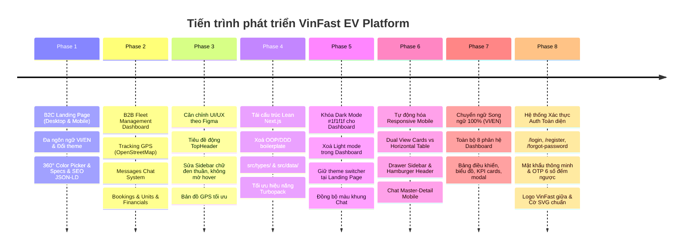

# VinFast EV Platform - Project Memory, Architecture & Future Roadmap

Tài liệu này ghi lại toàn bộ **lịch sử tiến trình phát triển**, **kiến trúc hệ thống**, **Project Memory (Bộ nhớ dự án)** và **giáo án lộ trình tương lai** của nền tảng VinFast EV Platform.

---

## 📌 1. Tổng Quan Dự Án (Project Overview)

**VinFast EV Platform** là hệ thống web doanh nghiệp kép tích hợp 3 phân hệ chủ lực:
1. **B2C Consumer Landing Page (`/`)**: Trang giới thiệu và đặt cọc chính thức các dòng xe máy điện thông minh VinFast (Klara, Feliz, Vento, Evo200) với thiết kế song ngữ (VI/EN) và hỗ trợ chuyển đổi Light/Dark mode.
2. **Authentication Suite (`/login`, `/register`, `/forgot-password`)**: Hệ thống xác thực đăng nhập, đăng ký với thanh đo độ mạnh mật khẩu, đặt lại mật khẩu và nhập mã OTP 6 số thời gian thực, đồng bộ cờ quốc gia SVG vector `🇻🇳 VIE` / `🇺🇸 ENG`.
3. **B2B Fleet Management & Car Rental Dashboard (`/dashboard/*`)**: Bảng điều khiển quản trị vận hành đội xe điện toàn diện, quản lý định vị GPS trực tiếp, luồng tin nhắn khách hàng, hợp đồng thuê xe, tài xế, lịch bảo dưỡng và hạch toán tài chính. Toàn bộ Dashboard được **khóa cứng chế độ Dark Mode chuẩn than chì `#1f1f1f`**.

---

## 🚀 2. Tiến Trình Phát Triển Chi Tiết (Milestones Timeline)

---

## 🧠 3. PROJECT MEMORY (Quy Tắc Bất Di Bất Dịch Của Dự Án)

> [!IMPORTANT]
> Đây là các nguyên tắc cốt lõi đã được thống nhất và phải luôn tuân thủ trong các phiên phát triển tiếp theo:

1. **Dashboard Dark Mode Lock (`#1f1f1f`)**:
   - Mọi trang bên trong `/dashboard/*` **bắt buộc** dùng nền `#1f1f1f` (`bg-[#1f1f1f]`).
   - Khối thẻ / card sử dụng `#1f1f1f` hoặc `#262626` / `#2a2a2a` với viền `#333333`.
   - **Tuyệt đối không** thêm nút chuyển Light mode vào thanh `TopHeader.tsx` của Dashboard.
2. **Landing Page Dual-Theme**:
   - Trang chủ `/` giữ nguyên bộ `ThemeProvider` độc lập (hỗ trợ cả Light và Dark mode qua CSS variables).
3. **Mô hình Dữ Liệu Tinh Gọn (Lean Next.js App Router)**:
   - Kiểu dữ liệu (Interfaces) tập trung tại `src/types/dashboard.ts`.
   - Dữ liệu tĩnh/mock tập trung tại `src/data/mockDashboardData.ts`.
   - **Không** tạo lại các lớp Class, DI Container, Service Singleton hay Repository thừa thãi.
4. **Tiêu Đề Trang Tự Động (Dynamic TopHeader)**:
   - Tiêu đề thanh trên cùng được suy ra tự động từ `pathname` trong `TopHeader.tsx`. Không đặt thẻ `<h2>` tiêu đề trang tĩnh bên trong thân component con để tránh trùng lặp.
5. **Kiểm Tra Chất Lượng Trước Khi Hoàn Thành (Quality Gate)**:
   - Luôn chạy `npx tsc --noEmit` (đạt 0 lỗi) và `npm run build` (biên dịch 22/22 routes thành công) trước khi bàn giao mã nguồn.

---

## 📚 4. GIÁO ÁN CHI TIẾT CÁC GIAI ĐOẠN TIẾP THEO (Curriculum & Roadmap)

### 🎯 Giai đoạn 9: Auth State Management, Route Protection & Local Persistence
- **Mục tiêu**: Xây dựng luồng đăng nhập/đăng xuất thực tế có lưu trữ phiên làm việc và bảo vệ các tuyến đường nội bộ.
- **Nội dung bài học & Công việc**:
  1. `AuthContext` / `Zustand store`: Lưu trạng thái người dùng (User Session, Profile Info, Token).
  2. Middleware bảo vệ tuyến đường (`src/middleware.ts`):
     - Chưa đăng nhập: Chuyển hướng từ `/dashboard/*` về `/login`.
     - Đã đăng nhập: Chuyển hướng từ `/login` hoặc `/register` vào thẳng `/dashboard`.
  3. Xử lý "Remember Me" (Ghi nhớ đăng nhập qua Cookie/LocalStorage).
  4. Trải nghiệm Đăng xuất (Logout Flow) mượt mà có modal xác nhận.

### 🎯 Giai đoạn 10: Tương tác CRUD Đầy đủ cho 8 Phân Hệ Dashboard
- **Mục tiêu**: Biến toàn bộ giao diện tĩnh thành các màn hình có thể thêm, sửa, xóa, lọc và tìm kiếm dữ liệu trực tiếp.
- **Nội dung bài học & Công việc**:
  1. **Đơn đặt xe (Bookings)**: Tạo đơn mới qua Modal form, đổi trạng thái (Pending -> Approved -> Done -> Cancelled), xóa đơn.
  2. **Kho xe (Units)**: Thêm xe mới vào kho, chỉnh sửa thông số pin/quãng đường/giá thuê, xóa xe khỏi kho.
  3. **Khách hàng & Tài xế (Clients & Drivers)**: Thêm mới tài xế/khách hàng, cập nhật bằng lái, chấm điểm đánh giá.
  4. **Tài chính (Financials)**: Tạo hóa đơn thu/chi mới, tự động tính tổng doanh thu/chi phí cập nhật lên biểu đồ dòng tiền (Cashflow Chart).
  5. **Persistence**: Tích hợp LocalStorage / IndexedDB giúp dữ liệu thao tác không bị mất khi F5 tải lại trang.

### 🎯 Giai đoạn 11: Mô phỏng Telemetry GPS Trực Tiếp & Real-time Live Chat
- **Mục tiêu**: Nâng cấp trải nghiệm vận hành thông minh cho hệ thống xe điện.
- **Nội dung bài học & Công việc**:
  1. **GPS Telemetry Simulation**: Mô phỏng tọa độ xe di chuyển mượt mà trên bản đồ OpenStreetMap/Leaflet theo lộ trình thực tế tại Hà Nội / TP.HCM.
  2. **Battery & Motor Diagnostics**: Giả lập mức tiêu hao pin CATL/LFP theo tốc độ xe, tự động kích hoạt cảnh báo pin yếu < 20% và gợi ý trạm sạc V-GREEN gần nhất.
  3. **Real-time Live Chat Engine**: Chat tương tác 2 chiều giữa Quản trị viên và Khách hàng/Tài xế có âm thanh thông báo và phản hồi tự động.

### 🎯 Giai đoạn 12: Backend RESTful API & Cơ Sở Dữ Liệu PostgreSQL / Prisma
- **Mục tiêu**: Xây dựng kiến trúc Full-stack hoàn chỉnh lưu trữ dữ liệu thật trên Cloud Database.
- **Nội dung bài học & Công việc**:
  1. Thiết kế Schema cơ sở dữ liệu quan hệ (ERD) bằng **Prisma ORM**:
     - `Users`, `Roles`, `Vehicles`, `Bookings`, `Drivers`, `Invoices`, `TelemetryLogs`.
  2. Xây dựng Next.js API Route Handlers (`/api/auth`, `/api/vehicles`, `/api/bookings`, `/api/invoices`).
  3. Seed dữ liệu toàn bộ các dòng xe điện VinFast chính hãng (VF 3, VF 5, VF 6, VF 7, VF 8, VF 9, Klara S, Feliz S, Evo200).

### 🎯 Giai đoạn 13: Cổng Thanh Toán & Xuất Báo Cáo Hóa Đơn PDF/Excel
- **Mục tiêu**: Tích hợp cổng thanh toán trực tuyến và báo cáo doanh nghiệp.
- **Nội dung bài học & Công việc**:
  1. Cổng thanh toán **VNPAY / MoMo / Stripe Sandbox**: Đặt cọc xe và thanh toán hóa đơn thuê xe.
  2. Xuất Hóa đơn điện tử VAT định dạng **PDF** chuẩn in ấn.
  3. Xuất bảng kê doanh thu, chi phí, danh sách đội xe định dạng **Excel (.xlsx)**.

### 🎯 Giai đoạn 14: Phân Quyền Đa Cấp Độ (RBAC) & Audit Logs
- **Mục tiêu**: Bảo mật doanh nghiệp và kiểm soát quyền hạn.
- **Nội dung bài học & Công việc**:
  1. Phân cấp 5 vai trò người dùng: **Super Admin**, **Quản lý đội xe (Fleet Manager)**, **Điều phối viên (Dispatcher)**, **Tài xế (Driver)**, **Khách hàng (Client)**.
  2. Hệ thống ghi vết nhật ký hoạt động (Audit Trail Logs).
